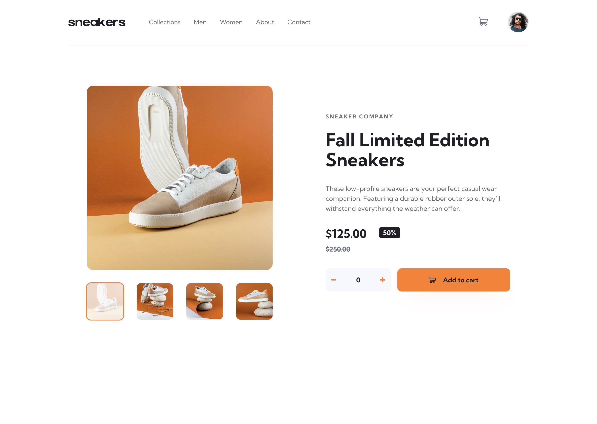

# Frontend Mentor - E-commerce product page solution

This is a solution to the [E-commerce product page challenge on Frontend Mentor](https://www.frontendmentor.io/challenges/ecommerce-product-page-UPsZ9MJp6). Frontend Mentor challenges help you improve your coding skills by building realistic projects.

## Table of contents

- [Overview](#overview)
  - [The challenge](#the-challenge)
  - [Screenshot](#screenshot)
  - [Links](#links)
- [My process](#my-process)
  - [Built with](#built-with)
  - [Useful resources](#useful-resources)
- [Author](#author)

## Overview

### The challenge

Users should be able to:

- View the optimal layout for the site depending on their device's screen size
- See hover states for all interactive elements on the page
- Open a lightbox gallery by clicking on the large product image
- Switch the large product image by clicking on the small thumbnail images
- Add items to the cart
- View the cart and remove items from it

### Screenshot

### Links

- Solution URL: [https://github.com/webdevbynight/ecommerce-product-page-main](https://github.com/webdevbynight/ecommerce-product-page-main)
- Live Site URL: [https://webdevbynight.github.io/ecommerce-product-page-main/](https://webdevbynight.github.io/ecommerce-product-page-main/)

## My process

### Built with

- Semantic HTML5 markup
- CSS (via SCSS)
  - custom properties
  - logical properties
  - flexbox
  - grid
- JavaScript (via TypeScript)
- Mobile-first workflow

### Useful resources

- [Turn Off Number Input Spinners](https://css-tricks.com/snippets/css/turn-off-number-input-spinners/) - This article helped me to turn off the spinners on an `<input type="number">` element on Safari for macOS (actually, only the `::-webkit-inner-spin-button` pseudo-element is enough for that purpose).
- [input / button elements not shrinking in a flex containerinput / button elements not shrinking in a flex container](https://stackoverflow.com/questions/42421361/input-button-elements-not-shrinking-in-a-flex-container) - This topic on Stack Overflow helped me to make the `input` shrink in a flex container.

## Author

- Website - [Victor Brito](https://victor-brito.dev)
- Frontend Mentor - [@webdevbynight](https://www.frontendmentor.io/profile/webdevbynight)
- Mastodon - [@webdevbynight](https://mastodon.social/webdevbynight)
- Bluesky - [@webdevbynight](https://bsky.app/profile/webdevbynight.bsky.social)
